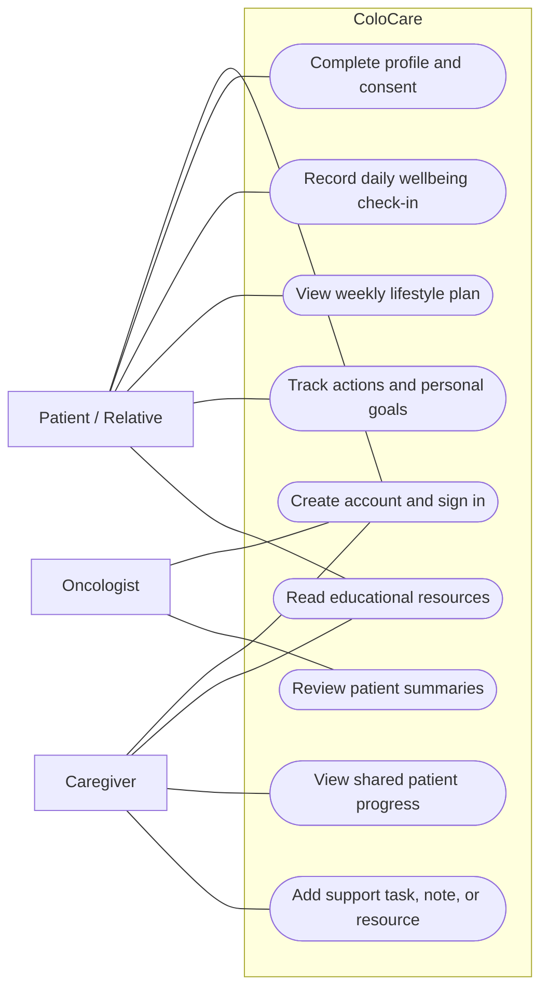
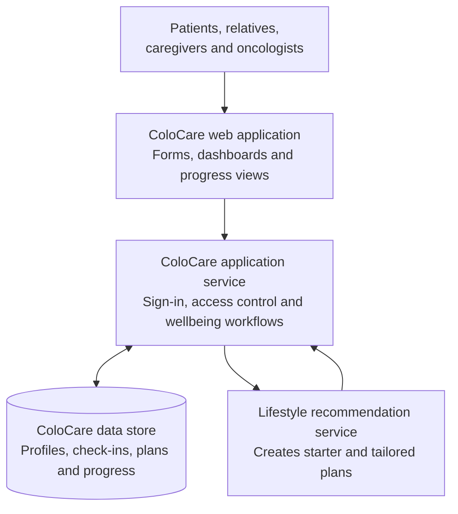
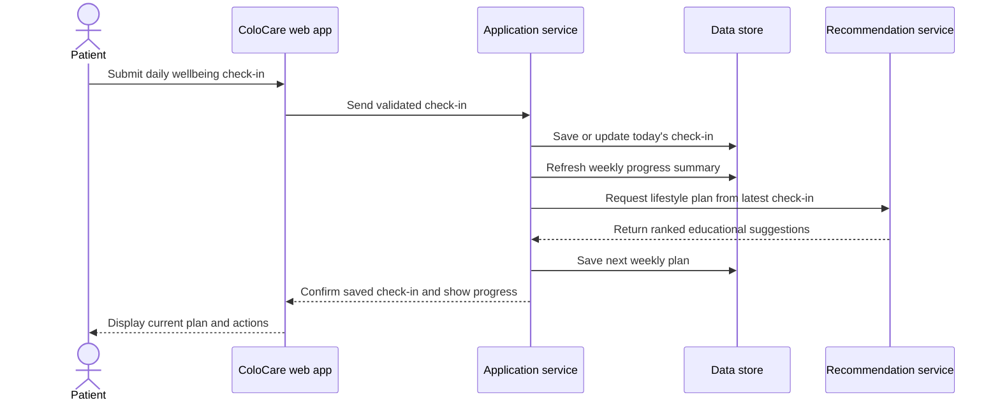
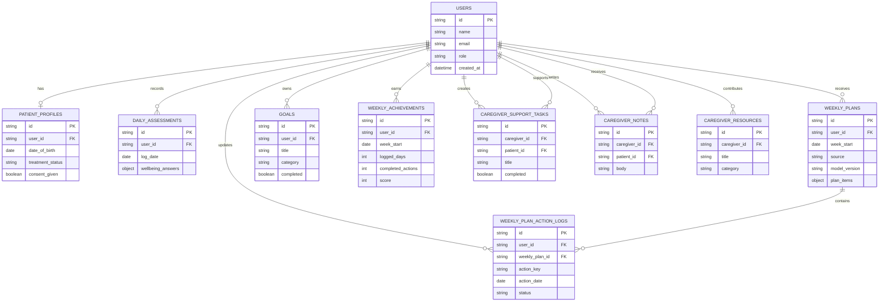
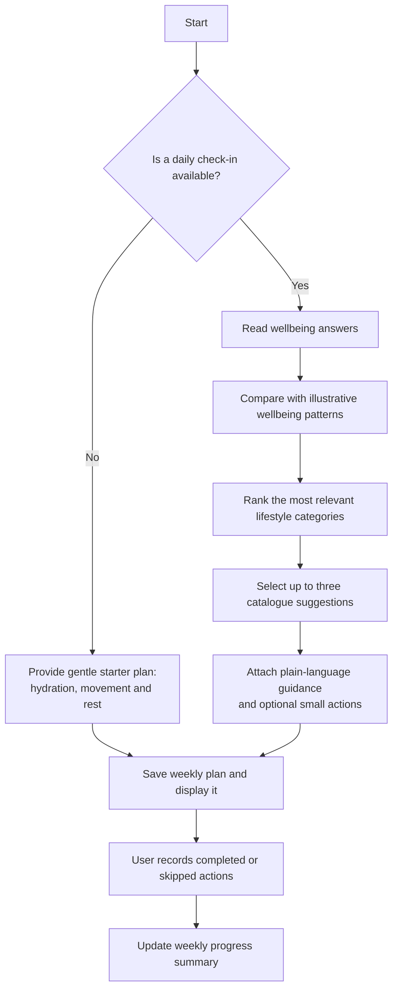

# ColoCare: System Specification and Design

## 1. Overview

ColoCare is a lifestyle-support application for people living after, or during, colorectal cancer treatment. It helps users reflect on everyday wellbeing, set achievable goals, receive gentle lifestyle suggestions, and access trustworthy educational material. It also gives caregivers and oncology staff an appropriate view of a patient's shared progress so they can offer support.

ColoCare is a school-project prototype. Its recommendations are educational prompts, not diagnosis, treatment, prescriptions, or emergency advice. Users should always contact their care team for medical concerns, especially new, severe, or persistent symptoms.

### 1.1 Stakeholders and users

| Group | Main interest in ColoCare |
| --- | --- |
| Patients | Record wellbeing, receive manageable lifestyle suggestions, set goals, and follow progress. |
| Relatives | Use the same support tools to encourage a loved one and understand healthy routines. |
| Caregivers | View shared progress, leave supportive notes, create practical tasks, and add helpful resources. |
| Oncologists | Review patient summaries, wellbeing patterns, and current lifestyle plans to inform conversations. |
| Project team / school | Demonstrate a safe, understandable digital-health workflow and evaluate the prototype. |

## 2. System Requirements Specification

### 2.1 Purpose and scope

The system provides lifestyle support between care interactions. It collects only the information needed to tailor a wellbeing plan: hydration, activity, sleep, stress, appetite, bowel comfort, and fatigue. It makes this information visible to the user and, where access is appropriate, to their support network.

The first release does not replace a hospital record, book appointments, prescribe medication, or make clinical decisions. It is designed to encourage reflection, small healthy actions, and better-informed conversations with healthcare professionals.

### 2.2 Functional requirements

| ID | Requirement |
| --- | --- |
| FR-01 | The system shall allow a user to create an account, sign in, and sign out securely. |
| FR-02 | The system shall identify whether a user is a patient, relative, caregiver, or oncologist and show the appropriate workspace. |
| FR-03 | The system shall collect patient onboarding information, including treatment status, relevant treatment history, survivorship symptoms, and consent before beginning patient lifestyle tracking. |
| FR-04 | The system shall let patients record a daily wellbeing check-in: water intake, activity, sleep, stress, appetite, bowel comfort, and fatigue. |
| FR-05 | The system shall create a gentle starter plan for a new user and a tailored weekly plan when recent check-ins are available. |
| FR-06 | The system shall present a small number of plain-language suggestions with optional, manageable daily actions. |
| FR-07 | The system shall allow patients to mark suggested actions as completed or skipped and to create and update personal goals. |
| FR-08 | The system shall show a calendar and weekly achievement summary so users can see their check-in and action progress. |
| FR-09 | The system shall provide educational resources on lifestyle and survivorship topics. Caregivers may contribute approved support resources. |
| FR-10 | The system shall allow caregivers to view shared patient progress, create support tasks, and save supportive notes. |
| FR-11 | The system shall allow oncologists to view patient summaries, including patient profile information, latest shared check-in, lifestyle plan, and progress summary. |
| FR-12 | The system shall validate required information and show understandable feedback when information is missing or unsuitable. |

### 2.3 Quality and safety requirements

| ID | Requirement |
| --- | --- |
| NFR-01 | The interface shall be simple, readable, and usable on common desktop and mobile web browsers. |
| NFR-02 | Sensitive information shall be available only after sign-in and only to users with the permitted role. |
| NFR-03 | Passwords shall not be stored in readable form; sessions shall expire and require sign-in again. |
| NFR-04 | The system shall protect data in transit and store patient data in a controlled database environment. |
| NFR-05 | Daily entries shall be dated and users shall not create entries for future days. |
| NFR-06 | The system shall keep a record of weekly plans and action progress so that summaries remain meaningful over time. |
| NFR-07 | If lifestyle suggestions are temporarily unavailable, the system shall explain this clearly and preserve previously saved information. |
| NFR-08 | Recommendations shall use supportive wording, identify their educational purpose, and direct users to their care team for medical concerns. |
| NFR-09 | Any future real-world deployment shall use approved, de-identified, clinically validated data and undergo appropriate clinical, privacy, and governance review. |

### 2.4 Use cases

## 3. System Architecture and Design

### 3.1 High-level design

ColoCare is organised as three cooperating parts. The web application is the space used by patients and staff. The application service handles sign-in, access rules, saved information, and the information shown on each screen. The recommendation service turns a wellbeing check-in into a small set of lifestyle suggestions. A shared database keeps the user's profile, check-ins, plans, goals, and support information.

This separation keeps the patient experience clear while allowing the recommendation approach to be improved independently in future versions.

### 3.2 Access design

Every user signs in before using personal information. The system uses each person's role to decide what workspace and information they can access. Patients manage their own information and goals. Caregivers use a support workspace for shared patient progress, tasks, notes, and resources. Oncologists use a clinical overview to review patient summaries. In a production rollout, access should also be tied to an explicit patient–care-team relationship and consent policy.

### 3.3 Daily check-in and weekly-plan flow

The check-in is designed to be brief. It saves the user's current wellbeing information, refreshes progress information, and makes it available for the next weekly plan. The first week uses a general starter plan; after check-ins exist, the system selects a more tailored plan.

### 3.4 Design principles

- Keep the interaction lightweight: a short daily reflection and a few actions are more realistic than a lengthy questionnaire.
- Use encouraging, non-judgemental language. An action can be completed or skipped without penalty.
- Make progress visible through a calendar and weekly summary, rather than using it as a medical score.
- Separate personal goals from system suggestions so users keep control over what matters to them.
- Preserve clear safety boundaries: suggestions support conversations with the care team; they do not interpret symptoms clinically.

## 4. Database Design

The data design centres on one user account. A patient may have one patient profile, many daily check-ins, several weekly plans, and many goals. Weekly plans include suggested actions; their day-by-day status is recorded separately. Caregiver tasks and notes connect a caregiver with the patient they support.

The design records dates and progress rather than overwriting history, enabling useful weekly summaries. The detailed answers of a daily check-in and the items in a generated plan are stored together as a structured record, which lets the prototype evolve its questions and plan wording without changing the main data relationships.

### 4.1 Main information held

| Information area | Examples | Why it is needed |
| --- | --- | --- |
| Account and role | Name, email, role | Sign-in and showing the right workspace. |
| Patient profile | Date of birth, treatment status/history, symptoms, consent | Gives context for lifestyle support and confirms patient consent. |
| Daily wellbeing | Hydration, movement, sleep, stress, appetite, bowel comfort, fatigue | Supports reflection and plan selection. |
| Weekly plan and actions | Suggestions, action status, plan source and version | Lets the user follow a plan and makes the process traceable. |
| Personal goals and achievements | User-created goals, check-in days, completed actions | Encourages self-management and shows progress. |
| Caregiver support | Notes, support tasks, contributed resources | Helps caregivers coordinate non-clinical encouragement. |

## 5. Lifestyle Recommendation Algorithm

### 5.1 Aim

The algorithm chooses up to three lifestyle focus areas from a defined catalogue: hydration, movement, rest and stress, nutrition, or maintaining a healthy routine. Each focus area contains supportive wording and a couple of small optional actions.

It is a demonstration decision-support approach. It does not assess cancer recurrence, diagnose bowel symptoms, determine treatment suitability, or make a clinical risk prediction.

### 5.2 Inputs and outputs

**Inputs:** the most recent daily check-in: water intake, activity minutes, sleep hours, stress level, appetite, bowel comfort, and fatigue.

**Output:** a weekly plan containing up to three ranked lifestyle suggestions, their plain-language explanation, and optional actions. The saved plan also records the version of the recommendation approach that produced it.

### 5.3 How a plan is selected

The prototype compares the most recent check-in with a small, illustrative set of previously defined wellbeing patterns. It identifies the most similar patterns and selects the lifestyle categories most strongly associated with them. A fixed starter plan (hydration, movement, and rest) is used until a daily check-in is available.

### 5.4 Safeguards and future improvement

The current pattern set is intentionally illustrative and suitable only for demonstration. Before clinical use, the project would need validated data, clinical review of all recommendation wording and thresholds, testing with diverse users, bias and safety assessment, ongoing monitoring, and a clear escalation pathway for concerning symptoms. The plan should remain explainable: users and clinicians should be able to see the lifestyle focus and the plain-language reason for each suggestion.
